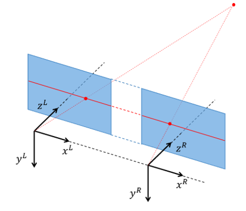

# Stereo calibration and processing

Welcome to this lab in the computer vision course [TEK5030] at the University of Oslo.

In this lab we will calibrate a stereo camera and experiment with stereo processing.
There are two versions of this lab, they differ in what way you want to retreive images:

- Stereo processing based on a stereo dataset from Kitti.
- Stereo _calibration_ and processing based on live images using the RealSense camera.

Start by cloning this repository on your machine. 
Then, open the lab project in your editor.

The lab is carried out by following these steps:

1. Get an overview: [Kitti approach][overview-kitti] or [RealSense approach][overview-rs].
2. [Stereo calibration](lab-guide/2-stereo-calibration.md).
3. [Sparse stereo processing](lab-guide/3-sparse-stereo-processing.md).
4. [Dense stereo processing](lab-guide/4-dense-stereo-processing.md).

You will find our proposed solution at https://github.com/tek5030/solution-stereo.
Please try to solve the lab with help from others instead of just jumping straight to the solution ;)

Please start the lab by selecting either the [Kitty approach][overview-kitti] (download an image dataset) or the [RealSense approach][overview-rs] (work with live camera images).

---

## Prerequisites

For this lab, we can unfortunately not rely on conan to install all required OpenCV modules (namely the `viz` module for 3D visualization). You have a few other options:

- Solve the [python lab](https://github.com/tek5030/lab-stereo-py) (recommended)
- Use the lab computers
- Install OpenCV using [homebrew](https://brew.sh/) (option for mac and linux). (See also [Getting started on MacOS](https://tek5030.github.io/tutorial/macos.html).)
- Rely on virtualbox and our prepared linux image with dependencies preinstalled (see [Canvas: Setting up your computer for the labs](https://uio.instructure.com/courses/44675/discussion_topics/295673))
- Try [Docker toolchain][docker-toolchain] in CLion (very experimental)

[overview-kitti]: lab-guide/1-get-an-overview-kitti.md
[overview-rs]: lab-guide/1-get-an-overview-realsense.md
[TEK5030]: https://www.uio.no/studier/emner/matnat/its/TEK5030/
[conan]: https://tek5030.github.io/tutorial/conan.html
[lab_intro]: https://github.com/tek5030/lab-intro/blob/master/cpp/lab-guide/1-open-project-in-clion.md#6-configure-project
[docker-toolchain]: https://tek5030.github.io/tutorial/dev-container.html