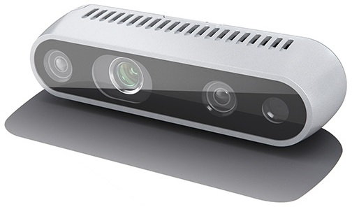

# Step 1: Get an overview
We will start by presenting an overview of the lab and the contents of this project.

## Stereo camera

In this lab we will experiment with stereo processing using the Intel RealSense D435 (shown above) which has 4 components:
  - 1 RGB color camera (rightmost in the image)
  - 2 panchromatic cameras without that are also sensitive in the invisible near-infrared (NIR) (leftmost & second from the right in the image).
    These cameras have a global shutter, which lets us avoid geometric distiortions during movement.
  - 1 NIR laser projector (second from the left in the image).
    The laser lets us project patterns onto the scene, which is used to support stereo matching in difficult areas.

Today, we will mainly use the two panchromatic cameras, but we can choose to activate the projector if we want to. 
It will illuminate the scene with a dotted pattern.

The D435 is precalibrated, and it can provide us with rectified stereo images.
To give you some practical experience with stereo calibration, we will instead capture unrectified images from the camera, and start by estimating the calibration parameters ourselves.

We have implemented a simple interface to the RealSense camera for the course in the [camera-library] repository.
This library has already been downloaded and installed on the lab machines.
If you are doing this lab without access to a RealSense stereo camera, we have also implemented the [dual_camera](https://github.com/tek5030/camera-library/blob/main/include/tek5030/dual_camera.h) interface to `cv::VideoCapture`, which lets you use two ordinary cameras to capture stereo images.
You will in this case need to change the lab code to use this interface instead.
Take a look at the [examples in camera-library](https://github.com/tek5030/camera-library/tree/main/example) to see how to use the camera interfaces.

If you are not on a lab computer, please install [camera-library] now by following the instructions in its README file.

[camera-library]: https://github.com/tek5030/camera-library

## Lab overview
The main steps of today's lab are:

- Stereo calibration
  - We will perform calibration by running the project in the [stereo_calibration](https://github.com/tek5030/stereo_calibration) repository.

- Sparse stereo processing
  - Establish point correspondences based on keypoint descriptors
  - Detect and discard bad correspondences based on the epipolar geometry
  - For each good correspondence:
    - Determine the disparity
    - Compute the depth in meters
    - Compute the 3D point

- Dense stereo processing
   - Experiment with existing implementations to produce dense depth images

## Introduction to the project source files

We have chosen to distribute the code on the following files:
- *main.cpp*
  
  Starts the lab, catches any exceptions and prints their error message on the console.

- *lab_stereo.h*, *lab_stereo.cpp*

  Implements the lab 7 loop. 
  You will add missing functionality to this loop.
  
- *stereo_calibration.h*, *stereo_calibration.cpp*

  Contains the definition of a class `StereoCalibration` that contains the results of our stereo calibration. 
  We will use this to rectify raw images from two cameras into properly aligned stereo images.
  You can also choose to read the calibration parameters directly from the RealSense camera, when capturing rectified images.

- *sparse_stereo_matcher.h*, *sparse_stereo_matcher.cpp*

  Contains the definition of a class `SparseStereoMatcher`. 
  This class is able to extract and match keypoints from both images in a `StereoPair`. 
  We will use these keypoint correspondences to do sparse stereo processing.
  
  You will add missing functionality to this class. 

- *viewer_3d.h*, *viewer_3d.cpp*

  Helper class that displays the processed stereo result as a 3D point cloud.
  
- *visualization.h*, *visualization.cpp*

  Helper class for visualizing matched point correspondences and estimated depth to image points.

- *cv_stereo_matcher_wrap.h*, *cv_stereo_matcher_wrap.cpp*

  Helper class for dense stereo processing.
  
In addition, we will use the following repositories:
  - [camera-library](https://github.com/tek5030/camera-library)
  - [stereo_calibration](https://github.com/tek5030/stereo_calibration)
    
Please continue to the [next step](2-stereo-calibration.md) to get started!
