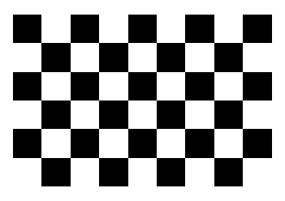
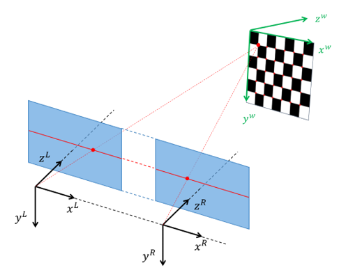

# Step 2: Stereo calibration
We have created a separate project for stereo calibration, so start by cloning the repository [stereo_calibration](https://github.com/tek5030/stereo_calibration) on your machine.
Then open it as a new CLion project.

## About the calibration target


In order to run the calibration project, you need a chessboard with the correct dimensions according to what is specified in the project.
Currently this should be a chessboard with 6 rows and 9 columns of squares that are 3.0cm wide.

Note however that in the calibration process, it is actually not the squares themselves that are being detected but the corner points between adjacent black squares.
There are 5 rows and 8 columns of such corner points.
So in the context of camera calibration, this chessboard is commonly said to have 5 rows and 8 columns.

## Calibration guidelines


Here are some guidelines for how to achieve a good calibration:

- The chessboard should be kept planar during the calibration process.
  We suggest that you keep it flat on a table and move the camera in order to capture images from different positions 
  and orientations.

- For a stereo image pair to be used in the calibration, **all corner points must be detected in both images**.

- In order to perform the stereo calibration we need at least 2, but preferably 20-30 or so, stereo image pairs captured from different positions, orientations and distances.
  - When you move the camera around capturing images of the chessboard, 
    try to change **ALL** degrees of freedom of the camera.
  - Remember to rotate the stereo camera about its optical axis!

- The camera model that we estimate should be valid for ALL pixels in the overlap between the stereo image pair.
  So it is important that we allow pixels from all over the cameras field of view to participate in the estimation.
  - Try to make sure that the chessboard is imaged in every region of the camera's field of view.

- When you capture an image, try to keep the camera and chessboard as static as possible to avoid any motion
  blur in the images.

## Using the stereo_calibration project
The *stereo_calibration* project is conceptually divided into two parts:
1. Capture stereo image pairs of the planar chessboard
   - When the project is running, you can capture images by pressing ```space```
   
2. Estimate the stereo camera parameters based on the stereo image pairs
   - After capturing a sufficient amount of stereo pairs, you press ```q``` to stop capturing images and proceed with the estimation
   - After the estimation, you will get to inspect the stereo rectified image pairs. 
     You can iterate through the inspection by pressing ```space```, but try to make sure that the rectification looks correct.
   - After the round of inspections, you will be presented with the average RMS (Root Mean Square) reprojection error as well as the average epipolar error.
     - We expect the RMS error to be around 0.2-0.3 pixels
     - We expect the epipolar error to be around 0.1-0.2 pixels
   - The calibration result is written to two files that you will find in the directory where you ran the project (typically in ```cmake-build-release``` or ```cmake-build-debug```).
        - ```intrinsics.yml``` contains the two perspective camera models and distortion coefficients.
        - ```extrinsics.yml``` contains the relative pose between the two cameras as well as the rotations and homographies that enable us to perform stereo rectification.

## Calibrate and copy the calibration files into lab_7
Run the stereo_calibration project.

When you are happy with the calibration, copy the two files ```intrinsics.yml``` and ```extrinsics.yml``` 
into the lab_7 project folder.


Continue to the [next step](3-sparse-stereo.md).

